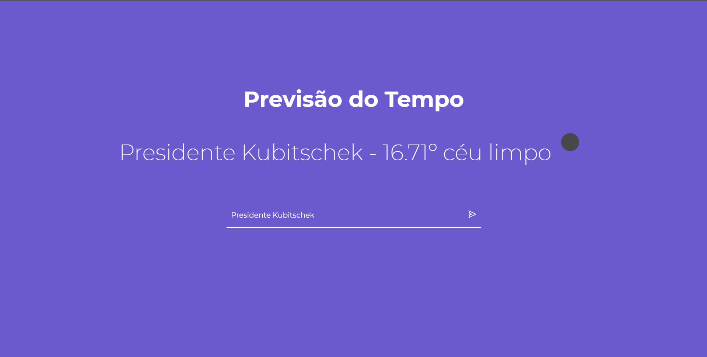
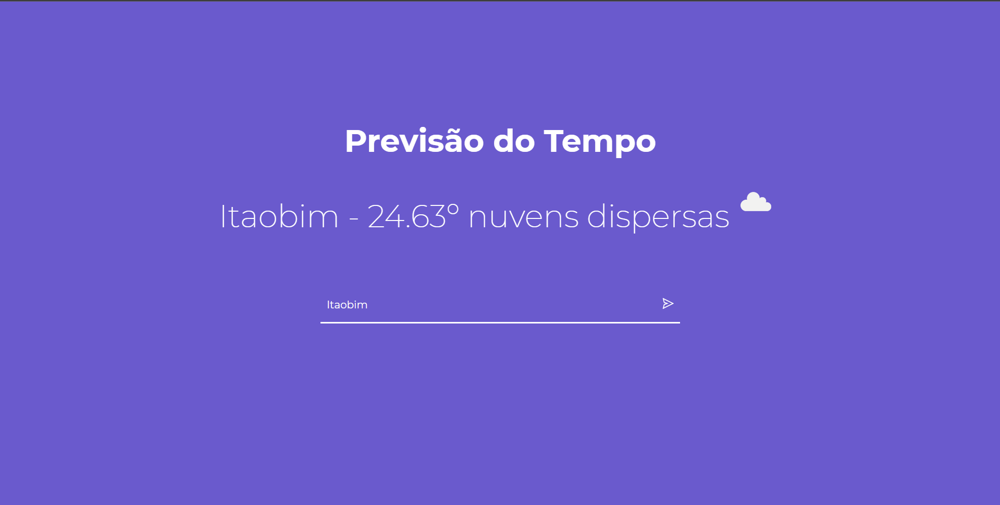

  <h1 align="center" >
          
     Previsão do Tempo com React JS - V1 </h1> 
  
  
Print Aplicação

 
 

<h1>🚀 Tecnologias</h1>
 

Esse projeto é um estudo de Front End usando as seguintes tecnologias:

- ✔️ Javascript  
- ✔️ ReactJS  
- ✔️ React Hooks  
- ✔️ Axios  
- ✔️ HTML  
- ✔️ CSS  

<h1>📝Creditos</h1>

Para conseguir pegar a latitude e longitude de cada cidade usei o repositorio do Kelvins
https://github.com/kelvins/Municipios-Brasileiros

 

 

<h1>ℹ️ Como usar</h1>

<pre>

# Clone o repositorio
$ git clone https://github.com/Ulisses97/Previsao-do-Tempo.git

# Puxe o repositorio 
$ cd Previsao do Tempo

# Instale as dependência
$ yarn install

# Execute o projeto
$ yarn start

<footer>
Feito com o ♥ por Ulisses Brandão👋
  

☕Bora tomar um café e conversar melhor?
</footer>
